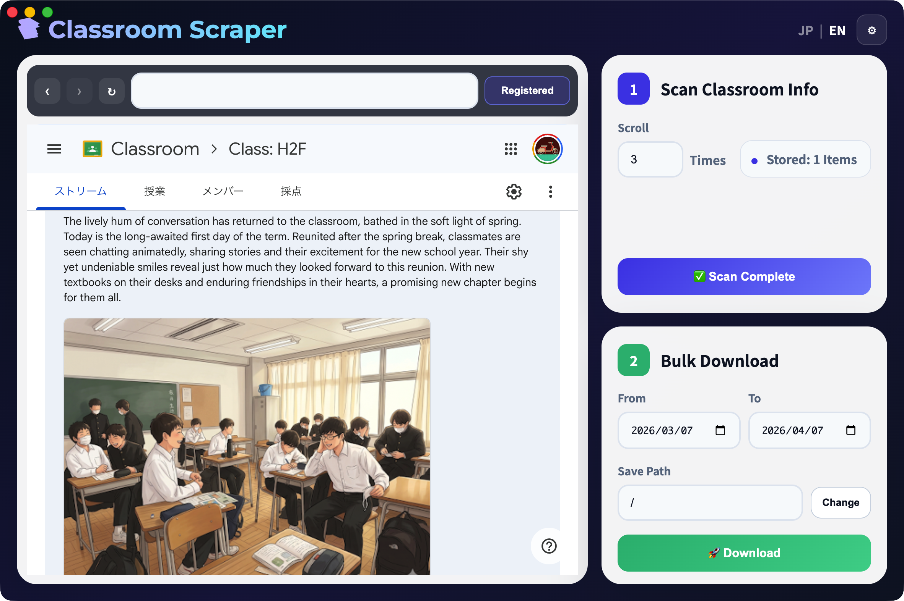

# Classroom Scraper v0.6.1

## Overview

Classroom Scraper is an Electron desktop app for browsing Google Classroom, scanning a class page, and downloading post content plus attachments in bulk.

This package contains the public release materials only:

- quick start guide
- product screenshot

The macOS DMG and Windows installer are attached to the GitHub Release for `v0.6.1` and are not stored in this repository.

## System Requirements

- macOS on Apple Silicon (`arm64`) or Windows x64
- Google account access to Google Classroom

## Quick Start

### macOS

1. Download the attached DMG from the GitHub Release.
2. Open the DMG file.
3. Drag `Classroom Scraper.app` into your `Applications` folder.
4. Launch the app.

### Windows

1. Download the attached NSIS installer from the GitHub Release.
2. Run the installer.
3. Follow the install steps.
4. Launch `Classroom Scraper` from the installed location or Start menu.

### First Use

1. Confirm the app starts in English mode.
2. Log in to Google Classroom inside the built-in browser.
3. Open a class page URL that contains `/c/`.
4. Click `Register`.
5. Use `Scan` to collect post URLs.
6. Set the date range and save path.
7. Click `Download`.

## Main Workflow

### 1. Browse and Register

Use the built-in browser on the left side to open a Google Classroom class page. Once the correct class page is visible, click `Register`.

### 2. Scan Classroom Info

Set the scroll count, then click `Scan`. The button will show progress while scanning and will change to `Scan Complete` after a successful run.

### 3. Bulk Download

Choose the date range and save path, then click `Download`. The app will extract matching posts and save messages and attachments into the selected folder.

## Notes

- The app keeps the Google login inside the embedded Chromium session.
- `Light Reset` clears the registered target, date range, save path, and URL cache for the current class.
- `Reset Browser` sends the built-in browser back to the Classroom home page without clearing your login session.

## Support

Buy me a coffee: [https://buymeacoffee.com/jflickeys](https://buymeacoffee.com/jflickeys)
